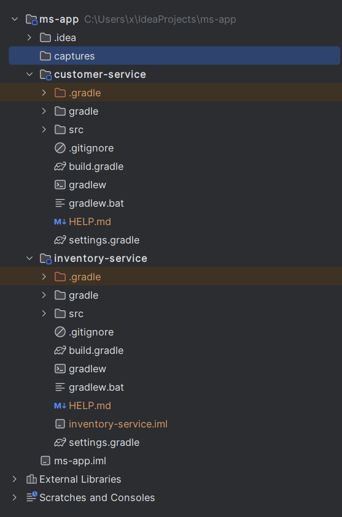

# ms-app

Bienvenue dans le projet ms-app ! Ce dépôt contient deux modules :

## Service Client

Le module Service Client est responsable de la gestion des fonctionnalités liées aux clients. Il fournit des API pour la création, la mise à jour et la récupération des informations clients.

### Technologies Utilisées
- [Java](https://www.java.com/)
- [Spring Boot](https://spring.io/projects/spring-boot)

### Utilisation
Pour exécuter le module Service Client en local :
1. Naviguez jusqu'au répertoire `customer-service`.
2. Exécutez `./mvnw spring-boot:run` pour démarrer le service.

## Service d'Inventaire

Le module Service d'Inventaire gère les tâches de gestion des stocks. Il offre des points de terminaison pour gérer les articles du stock, y compris l'ajout, la mise à jour et la consultation des articles du stock.

### Technologies Utilisées
- [Java](https://www.java.com/)
- [Spring Boot](https://spring.io/projects/spring-boot)

### Utilisation
Pour exécuter le module Service d'Inventaire en local :
1. Naviguez jusqu'au répertoire `inventory-service`.
2. Exécutez `./mvnw spring-boot:run` pour démarrer le service.

## Contribution
Les contributions sont les bienvenues ! Si vous souhaitez contribuer à ce projet, veuillez forker le dépôt et soumettre une pull request avec vos modifications.

## Licence
Ce projet est sous licence [MIT License](LICENSE).

---

Ce projet est le premier TP du module Systèmes Distribués.

## Commandes pour Pousser le Code sur GitHub

1. `git init`
2. `git add .`
3. `git commit -m "Premier Commit"`
4. `git remote add origin https://github.com/zerotwos02/ms-synthese.git`
5. `git push -u origin master`
